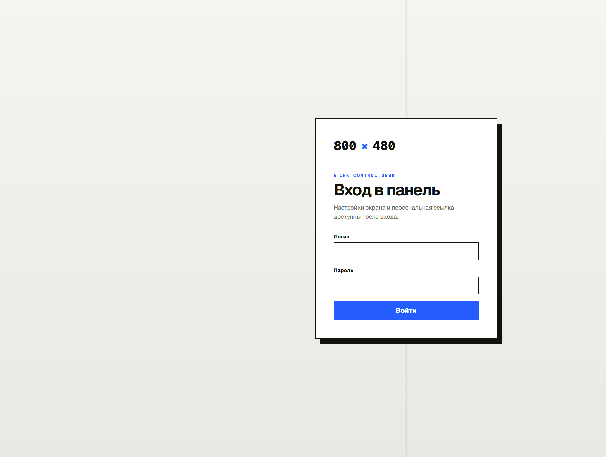
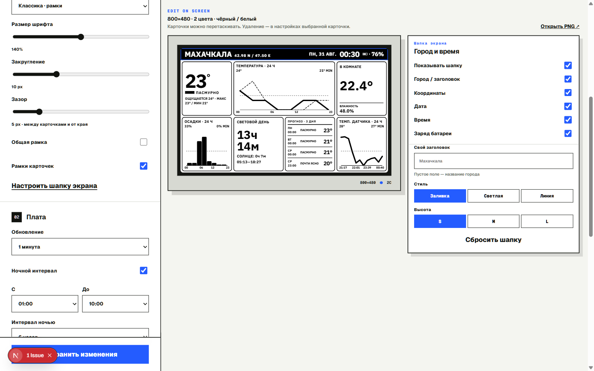
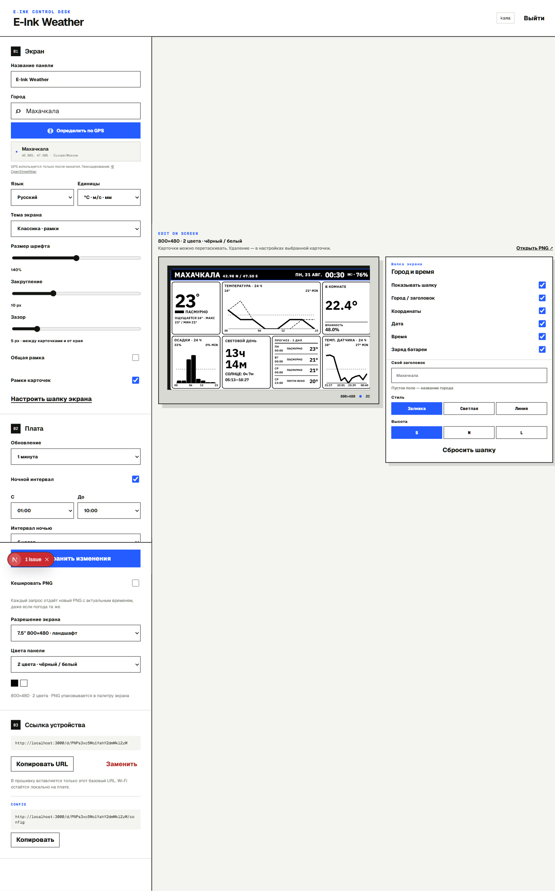
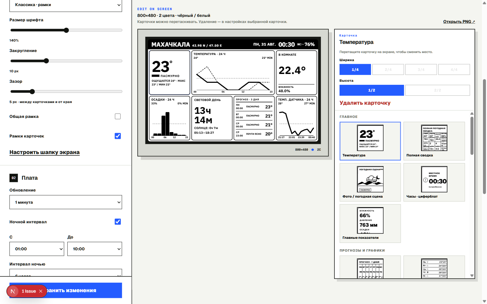
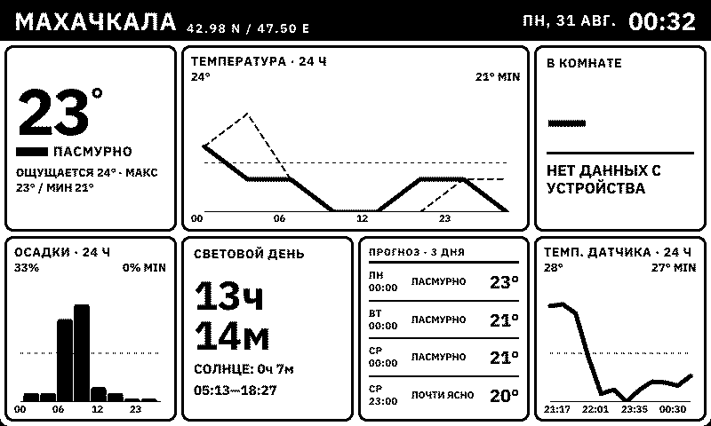

<!-- GSD:docs-update -->

# Интерфейс Control Desk

Скриншоты сняты с локального сервера [http://localhost:3000/](http://localhost:3000/) 31 августа 2026 (сессия уже была открыта). На проде тот же редактор: [weather-e-ink.vercel.app](https://weather-e-ink.vercel.app/).

Не публикуйте скрины вместе с персональным URL из блока **03**.

## Вход

Пока пользователей нет — **«Первый запуск»** и **«Создать владельца»**.

## Редактор

Слева секции **01 Экран** / **02 Плата** / **03 Ссылка устройства**, справа превью 800×480. Карточки перетаскиваются целиком.

Полная страница (включая **03** и кнопку сохранения):

### Инспектор карточки

Клик по карточке на превью открывает ширину/высоту в клетках, смену типа и **«Удалить карточку»**. Каталог сгруппирован: Главное, прогнозы, атмосфера и т.д.

### 01 — Экран

Название, город (поиск ≥ 2 символов и выбор из списка), GPS, язык, единицы, тема, шрифт, скругление, зазор, рамки, **«Настроить шапку экрана»**.

### 02 — Плата

Интервал обновления, ночное окно по поясу города, кеш PNG, разрешение, цвета. Для FireBeetle + FPC-8612: **800×480**, **чёрный / белый**.

### 03 — Ссылка устройства

Базовый `/d/{slug}` в прошивку. **«Копировать URL»**, **«Заменить»**, отдельно `/config`.

**«Открыть PNG ↗»** — кадр без query ESP32. Датчик на превью — демо (`22.4°` / `48%`), на плате — живые query.

## Кадр PNG

